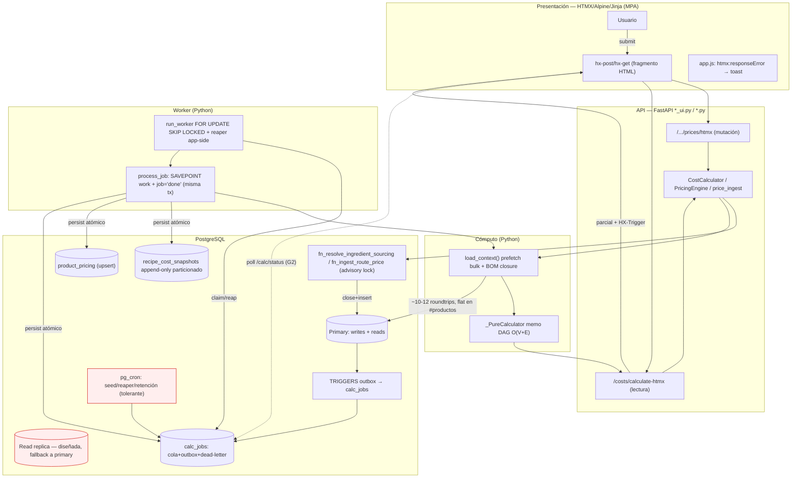

# Auditoría Arquitectónica Global E2E — CPQ Qargo Coffee

> Revisión holística de las 3 capas (PostgreSQL ⇄ Motor Python ⇄ Front-End HTMX),
> enfocada en contratos, data lineage, resiliencia en cascada y límites de escala.
> Fecha: 2026-06-05.

## Correcciones de premisas (auditoría honesta)

El sistema real difiere de supuestos comunes:
- **No usa `SERIALIZABLE` ni produce `40001`.** Concurrencia de precios =
  `pg_advisory_xact_lock` (bloquea, no falla) + `EXCLUDE` (lanza `23P01`).
- **No hay re-renders en cascada en el navegador.** Es MPA HTMX; el server
  re-renderiza solo el parcial pedido. Riesgo de UI = payload HTML denso.
- **Los costos NO son tiempo real.** El recálculo es asíncrono (cola `calc_jobs`);
  el FE muestra "recalculando…" pero hoy no sabe cuándo termina (gap G2).

---

## 1. Topología E2E



---

## 2. Contratos y acoplamiento

**FE ⇄ API** — payload = HTML (HTMX), no JSON. Server compone el parcial exacto →
**sin over/under-fetching de campos**. Riesgo = tamaño del parcial denso →
mitigado por filtro obligatorio + (pendiente) cursor pagination. **GraphQL no
aplica** (no hay grafo cliente). **SSE/polling sí** para progreso async (G2).

**BE ⇄ DB** — `load_context` mató el N+1: precio set-based (LATERAL) + bulk por
tabla → **~10-12 roundtrips planos respecto a #productos**. `_bom_closure` itera
O(profundidad). Riesgo a escala: el LATERAL ejecuta `fn_resolve_ingredient_sourcing`
→ `fn_resolve_supply_route` **por fila** (fan-out de funciones) → G5.

---

## 3. Resiliencia

**OOM a mitad de batch:** consistencia garantizada por **atomicidad** (SAVEPOINT +
commit junto con `status='done'`), NO por cleanup con `batch_run_id`. OOM → tx no
commitea → rollback total → **sin snapshots parciales**. `batch_run_id` =
agrupar/retención, no cleanup. Cabo suelto: job queda `running` → lo requeu­ea el
reaper (G1). FE no reacciona (el precio se guardó síncrono); no ve que el costo no
se recalculó (G2).

**Concurrencia (corrección):** sin `40001`. Advisory lock serializa por ruta
(espera). Único error real = `EXCLUDE 23P01` (inline). Falta `lock_timeout` +
retry acotado para que ráfagas a la misma ruta no apilen requests (G7).

---

## 4. Escalabilidad 100x

- **Cómputo:** `_PureCalculator` stateless → N workers con `SKIP LOCKED` (sin
  coordinación). Falta supervisor multi-proceso (operativo).
- **I/O:** todo al primary (réplica diseñada, no usada → G4). Snapshots por **año**
  → pasar a mensual (G6). Polling de cola → LISTEN/NOTIFY (G8).
  `sync_store_supplier_history` serial por ingrediente (G9).
- **UI (corrección):** sin caché cliente ni cascade re-renders → **el browser
  escala bien**; costo se mueve al server (render denso) → filtro+paginación+skeletons.
  Capa de menor riesgo.

---

## 5. Matriz de hallazgos globales

| # | Antipatrón | Capas | Gravedad | Consolidación | Estado |
|---|---|---|---|---|---|
| G1 | Reaper/retención solo en pg_cron (ausente en Supabase) → jobs colgados + dead sin alerta | DB+Compute+FE | 🔴 Crítica | Reaper **app-side** + surface de dead | ✅ implementado |
| G2 | FE no sabe cuándo terminó el recálculo async | FE+API+DB | 🔴 Crítica | Endpoint `/calc/status` + polling HTMX | ✅ implementado |
| G3 | UI de precios hace close+insert manual (sin lock ni outbox) | FE+DB+Compute | 🟠 Mayor | Migrar a `fn_ingest_route_price` | ✅ implementado |
| G4 | Lecturas de contexto al primary (réplica no usada) | Compute+DB | 🟠 Mayor | Plumbing de read-replica con fallback | ✅ implementado (fallback) |
| G7 | Sin `lock_timeout`/retry; sin idempotency-key | FE+API+DB | 🟠 Mayor | `lock_timeout` + retry 55P03/40P01 | ✅ implementado (lock+retry) |
| G5 | LATERAL fan-out de resolución de sourcing por fila | BE+DB | 🟠 Mayor | Matview de resolución refrescada por outbox | 📋 diseñado (deferred) |
| G6 | Snapshots particionados por año | DB | 🟡 Menor | Partición mensual + retención fallback | 📋 diseñado (deferred) |
| G8 | Polling sin LISTEN/NOTIFY | Compute+DB | 🟡 Menor | NOTIFY en outbox + worker LISTEN | 📋 diseñado (deferred) |
| G9 | `sync_store_supplier_history` serial | Compute+DB | 🟡 Menor | Chunked + job paralelo | 📋 diseñado (deferred) |

> Deferred = requiere migración invasiva o load-testing; medio-implementarlo sería
> riesgoso. Diseño abajo (§7) para ejecución posterior con datos de carga reales.

---

## 6. Blueprints — contratos e idempotencia

### 6.1 Mutación síncrona (precio)
```
POST /supply-chain/routes/{id}/prices/htmx
  Headers: HX-Request, Idempotency-Key (futuro)
  Server:  SET LOCAL lock_timeout='3s'; fn_ingest_route_price(...) (lock+outbox)
  200 + parcial + HX-Trigger: prices-changed         (éxito)
  200 + parcial con error inline                     (validación / 23P01 / 55P03)
  5xx → htmx:responseError → toast (nunca pantalla en blanco)
```

### 6.2 Estado de recálculo (G2)
```
GET /calc/status?ingredient_id=N
  → {"pending":k,"running":m,"dead":d,"stale":bool}
FE: hx-trigger="prices-changed from:body, every 3s"; para de pollear cuando pending+running=0.
    dead>0 → badge "recálculo falló".
```

### 6.3 Política de reintentos / idempotencia
```
SÍNCRONO:  advisory lock (no 40001). lock_timeout=3s. Retry solo 55P03/40P01 (máx 2, backoff jitter).
           23P01 (EXCLUDE) NO se reintenta (error de datos → inline).
ASÍNCRONO: at-least-once. Idempotente: job 'done' en la MISMA tx + product_pricing UPSERT
           + snapshots append-only por batch_run_id. Reaper app-side + pg_cron. Dead-letter visible.
NUNCA:     SERIALIZABLE global; depender solo de pg_cron para liveness de la cola.
```

---

## 7. Diseño de los diferidos (G5/G6/G8/G9)

- **G5 matview de sourcing:** `mv_ingredient_sourcing(ingredient_id, store_id,
  recipe_unit_id) → (route, unit_price_cop, purchase_qty, recipe_qty, source)`,
  refrescada `CONCURRENTLY` por un job `sourcing_refresh` encolado desde los mismos
  triggers outbox (price/route change). `load_context` lee la matview en vez del
  LATERAL. Riesgo: tamaño (ingredientes×tiendas×unidades) → empezar materializando
  solo combinaciones referenciadas por recetas activas.
- **G6 partición mensual:** nueva migración que crea particiones mensuales hacia
  adelante (reusar `ensure_yearly_partition` → variante mensual) + retención 90d con
  fallback app. No re-particionar histórico (dejar las anuales viejas).
- **G8 LISTEN/NOTIFY:** `NOTIFY calc_jobs` en el trigger outbox; `run_worker` abre
  conexión en modo LISTEN y despierta en evento; pg_cron como heartbeat de respaldo.
- **G9 ssh chunked:** `sync_store_supplier_history` como job `sourcing_sync` por
  tienda (ya es tipo de job) → N workers lo paralelizan; lote por ingrediente con
  un solo advisory lock por (store,batch).

---

## Veredicto

Arquitectura **fundamentalmente sólida**: outbox transaccional, idempotencia por
atomicidad (no cleanup), motor stateless, FE sin males del SPA. Los riesgos reales
no eran los del enunciado (no hay 40001 ni cascade re-renders) sino **2 cabos en el
lazo async** (G1 liveness de la cola, G2 invisibilidad del fin del recálculo) +
migrar la UI de precios al camino seguro (G3). Implementados G1-G4 y G7;
G5/G6/G8/G9 quedan diseñados para ejecutarse con carga real.
