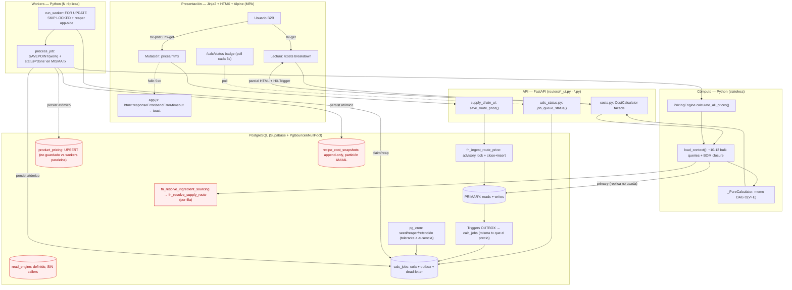

# Auditoría Arquitectónica Global E2E — CPQ Qargo Coffee (revisión independiente V2)

> Segunda revisión holística de las 3 capas (PostgreSQL ⇄ Motor Python ⇄ Front-End HTMX).
> Verifica `E2E_ARCHITECTURE_AUDIT.md` (2026-06-05) contra el código real y añade
> hallazgos que esa auditoría no cubre. Enfocada en granularidad del trabajo async,
> amplificación de recálculo, plumbing de réplica y carreras de persistencia.
> Fecha: 2026-06-08.

## 0. Corrección de premisas del enunciado (confirmado en código)

Tres supuestos comunes **no aplican** a este sistema:

- **No hay `SERIALIZABLE` ni error `40001`.** La concurrencia de precios se serializa con
  `pg_advisory_xact_lock` por ruta (`fn_ingest_route_price`, migración 0024 línea 166) +
  constraints `EXCLUDE`. Los errores reintentables reales son `55P03` (lock_timeout) y
  `40P01` (deadlock). Confirmado en `backend/services/supplier_pricing.py:26`.
- **No hay re-renders en cascada en el navegador.** Es un MPA HTMX; el server renderiza el
  parcial pedido. `static/js/app.js` son 55 líneas: 3 listeners de error → toast. Sin caché
  de queries cliente ni grafo reactivo. El riesgo de UI es el tamaño del parcial HTML.
- **Los costos NO son tiempo real.** El recálculo es asíncrono vía cola `calc_jobs`; el FE
  observa el avance por polling de `/calc/status`.

---

## 1. Topología E2E



Rojo = cabo suelto vivo en código (no solo diseño): réplica sin callers, fan-out de
funciones por fila, UPSERT no protegido contra workers concurrentes, partición anual.

---

## 2. Contratos, protocolos y acoplamiento

### FE ⇄ API
- **Payload = HTML, no JSON.** El server compone el parcial exacto → **no hay over-fetching
  ni under-fetching de campos** por construcción.
- **GraphQL no aplica:** no hay grafo de datos en cliente que justifique el resolver-graph.
- **SSE vs polling:** el progreso async se resuelve con **polling HTMX cada 3s** a
  `/calc/status` (`backend/routers/calc_status.py`). A 17 tiendas, polling gana (menos estado
  en server, sin conexiones colgadas con PgBouncer/NullPool). SSE solo se justificaría con
  miles de clientes concurrentes observando el mismo recálculo.
- **Riesgo real:** densidad del parcial HTML en matrices de precios → filtro obligatorio +
  cursor pagination (pendiente). No crítico.

### BE ⇄ DB
- `load_context` **mató el N+1**: resolución de precios set-based vía un solo
  `CROSS JOIN LATERAL` + bulk por tabla. Roundtrips **planos respecto al número de
  productos** (~10-12), confirmado en `backend/services/cost_calculator.py:271-532`.
- **El N+1 se transformó, no desapareció (G5, confirmado):** el LATERAL ejecuta
  `fn_resolve_ingredient_sourcing` **una vez por fila** `(ingredient, recipe_unit)`, y esa
  función llama `fn_resolve_supply_route` por fila (migración 0022, línea 76). Fan-out de
  funciones plpgsql `STABLE` con sub-SELECTs. Roundtrips planos, pero el **trabajo dentro del
  único roundtrip crece linealmente con keys distintas × profundidad de resolución de ruta**.
  A 100x es el hotspot de CPU de la DB.

---

## 3. Resiliencia en cascada

### OOM a mitad de batch — la auditoría previa lo subestimó
"Atomicidad garantiza consistencia" es **correcto pero incompleto**. `process_job`
(`backend/services/calc_worker.py:167`): `SAVEPOINT` + `_mark_done` + `commit` en la misma tx
→ OOM antes del commit hace rollback total, **sin snapshots parciales**. Idempotencia por
atomicidad: correcta.

**Problema nuevo que nadie modeló:** `batch_chunk` es un nombre engañoso. El seed nocturno
(0024, líneas 202-213) encola **un job por tienda con `product_ids = array_agg(TODOS los
productos activos)`**. `process_job` → `calculate_all_prices` → **un solo `load_context` de
TODO el catálogo** + acumula **todos** los `RecipeCostSnapshot` ORM en la sesión hasta un
único commit final (`backend/services/pricing_engine.py:418`).

Cascada a escala:
1. El "chunk" carga el catálogo entero + cierre BOM + todo el sourcing en memoria de un worker.
2. OOM → tx no commitea → reaper marca `pending` con backoff exponencial → **se reintenta el
   mismo job gigante** → OOM otra vez → tras `max_attempts=5` → `dead`.
3. Resultado: **el recálculo de toda una tienda se dead-letterea en bloque**, no degrada
   parcialmente. El FE ve `dead>0` pero no recupera nada sin intervención.

Es el escenario OOM exacto del brief, vivo y sin mitigar. La atomicidad protege la
*corrección* pero no la *progresividad*: no hay chunking real por tamaño de lote.

### Concurrencia extrema — verificado, con hueco nuevo
- `fn_ingest_route_price` serializa por ruta con advisory lock; `save_route_price` añade
  `lock_timeout=3s` + retry acotado de `55P03/40P01` (máx 2, backoff). Sólido para el INGEST.
- **Hueco nuevo (no estaba en G1-G9):** el advisory lock protege el INGEST del precio, **pero
  NO el UPSERT de `product_pricing`** que hacen los workers. `save_pricing`
  (`backend/services/pricing_engine.py:211-241`) es un read-modify-write
  (`query existing → update/insert`) **sin lock**. Dos workers procesando `batch_chunk`
  solapados para el mismo `(product,size,store)` → carrera sobre `uix_product_pricing_current`
  → uno gana, el otro recibe `23505` → `process_job` lo captura → rollback savepoint →
  requeue. No corrompe, pero bajo carga genera **retries en cascada por colisión**.

### Amplificación de recálculo (cabo suelto NUEVO)
Cargar un CSV de N precios (`backend/services/price_ingest.py` → `fn_ingest_route_price` por
fila) dispara **N triggers outbox** → **N jobs `route_change`**. Cada `route_change` el worker
lo expande vía `reverse_bom_closure` y encola **un `batch_chunk`**
(`backend/services/calc_worker.py:184-189`). Sin coalescing/dedup:
- 1000 precios subidos → hasta 1000 `route_change` → hasta 1000 `batch_chunk` **solapados
  sobre los mismos productos**.
- Re-cómputo redundante O(N) + colisiones `23505` del hallazgo anterior → **thundering herd**.

No hay debounce ni clave de coalescing en `calc_jobs`. Es el riesgo de escalabilidad más
concreto del lazo async.

---

## 4. Escalabilidad multi-dimensión (hacia 100x)

### Cómputo (CPU/memoria)
- `_PureCalculator` es stateless puro sobre `CalcContext` inmutable (frozen dataclass, sin
  sesión DB) → escalado horizontal trivial: N workers con `FOR UPDATE SKIP LOCKED`, cero
  coordinación.
- **Pero** el escalado horizontal no ayuda si **un solo job no cabe en un worker** (§3 OOM).
  Falta: granularidad de chunk por tamaño (p.ej. lotes de 200 productos) y un supervisor
  multi-proceso. Sin eso, "más workers" no resuelve el OOM de catálogo completo.

### Datos (I/O)
- **Réplica de lectura: cabo suelto vivo.** `backend/database.py:56-87` define `read_engine` +
  `ReadSessionLocal` + `get_read_db()`, pero **ningún router/servicio llama `get_read_db`** —
  `load_context` recibe siempre la sesión primaria vía `get_db`. La matriz previa marca G4
  "✅ implementado (fallback)"; la realidad es **plumbing muerto**: existe el cableado, no la
  conexión. A 100x, todo el prefetch read-heavy sigue pegándole al primary.
  - Riesgo al activarlo: read-after-write. Si `get_cost_breakdown` lee de réplica justo tras
    una mutación, muestra costo stale. El snapshot graba `price_valid_from` (reproducibilidad
    OK) pero no resuelve frescura. Rutear a réplica **solo** el batch async, nunca la lectura
    on-demand post-mutación.
- **Snapshots:** append-only, **partición ANUAL** (G6 confirmado) + `snapshot_detail` JSONB
  grande por línea. A 100x: productos × tiendas × tallas × noches en pocas particiones
  gigantes. Retención 90d vía pg_cron tolerante → en Supabase **no corre** y no hay cleanup
  app-side de snapshots (solo de jobs). → particionar mensual + retención app-side de fallback.
- `store_supplier_history` sync serial por ingrediente (G9 confirmado,
  `backend/services/sourcing_sync.py`).

### UI (browser) — capa de menor riesgo
- Sin caché cliente, sin cascade re-renders (MPA). El browser escala bien. El costo se traslada
  al server (render de parciales densos). Mitigación = paginación + skeletons.

---

## 5. Matriz de hallazgos globales

Leyenda estado: ✅ verificado-implementado · ⚠️ verificado-INCOMPLETO · 🆕 hallazgo nuevo.

| # | Vulnerabilidad / Antipatrón | Capas | Gravedad | Consolidación | Estado |
|---|---|---|---|---|---|
| **N1** | `batch_chunk` = catálogo COMPLETO en memoria + todos los snapshots antes de un commit → OOM dead-letterea la tienda entera; "chunk" es misnomer | Compute+DB+FE | 🔴 Crítica | Chunking real por tamaño (≤200 prod/job); seed nocturno trocea `product_ids` | 🆕 |
| **N2** | Amplificación de recálculo: ingest masivo → 1 job `route_change`→`batch_chunk` por fila, sin coalescing → thundering herd + colisiones | DB+Compute | 🔴 Crítica | Coalescing key `(job_type,store_id,coalesce_key)` con UPSERT `ON CONFLICT DO NOTHING` mientras `pending` | 🆕 |
| **N3** | Réplica de lectura: `read_engine`/`get_read_db` definidos pero **sin un solo caller** → todo prefetch al primary | Compute+DB | 🟠 Mayor | Inyectar `get_read_db` SOLO en batch async; nunca en lectura post-mutación | 🆕 (corrige G4) |
| **N4** | `product_pricing` UPSERT (read-modify-write) sin lock vs workers paralelos → carrera `23505`, retries en cascada | Compute+DB | 🟠 Mayor | Advisory lock por `(product,size,store)` en `save_pricing`, o `INSERT … ON CONFLICT DO UPDATE` atómico | 🆕 |
| **N5** | Acoplamiento por string: `_bulk_markups`/`_resolve_markup` unen `CategoryMargin.category` ↔ `product.category` por VARCHAR (el FK `category_id` de la Fase 6 nunca llegó al motor) → margen "fantasma" por typo | Compute+DB | 🟡 Menor | Migrar el join del motor a `category_id`; el plan ya lo previó | 🆕 |
| G1 | Liveness de cola dependía de pg_cron (ausente en Supabase) | DB+Compute+FE | 🔴 Crítica | Reaper app-side (`reap_stale_jobs`) | ✅ |
| G2 | FE no sabía cuándo terminó el recálculo | FE+API+DB | 🔴 Crítica | `/calc/status` + polling badge | ✅ |
| G3 | UI de precios hacía close+insert manual sin lock ni outbox | FE+DB | 🟠 Mayor | `fn_ingest_route_price` (`supply_chain_ui.py:467`) | ✅ |
| G5 | LATERAL fan-out: `fn_resolve_ingredient_sourcing`→`fn_resolve_supply_route` por fila | BE+DB | 🟠 Mayor | Matview `mv_ingredient_sourcing` refrescada por outbox | 📋 diferido |
| G6 | Snapshots partición anual; retención solo pg_cron (no Supabase) | DB | 🟡 Menor | Partición mensual + retención app-side fallback | 📋 diferido |
| G7 | Sin `lock_timeout`/retry en ingest | API+DB | 🟠 Mayor | `lock_timeout=3s` + retry `55P03/40P01` | ✅ |
| G8 | Polling de cola sin LISTEN/NOTIFY | Compute+DB | 🟡 Menor | `NOTIFY` en outbox + worker LISTEN | 📋 diferido |
| G9 | `sync_store_supplier_history` serial por ingrediente | Compute+DB | 🟡 Menor | Chunked + job paralelo | 📋 diferido |

**Prioridad de ejecución:** N1 y N2 son críticos y **se refuerzan mutuamente** (N2 genera
muchos jobs, N1 hace que cada uno sea peligroso). Atacar ambos antes que cualquier diferido
G5-G9.

---

## 6. Blueprints definitivos (contratos + idempotencia)

### 6.1 Contrato — mutación síncrona de precio
```
POST /supply-chain/routes/{id}/prices/htmx
  Req:  HX-Request: true; (futuro) Idempotency-Key: <uuid>
  Server: SET LOCAL lock_timeout='3s';
          SELECT fn_ingest_route_price(...)   -- advisory lock + close+insert + outbox
  200 + parcial HTML + HX-Trigger: prices-changed     (éxito; dispara badge de /calc/status)
  200 + parcial con error inline                      (validación / 23P01 EXCLUDE / 55P03 agotado)
  5xx → app.js htmx:responseError → toast             (nunca pantalla en blanco)
Retry: SOLO 55P03/40P01, máx 2, backoff 100/200ms. 23P01 NUNCA (error de datos → inline).
```

### 6.2 Contrato — estado de recálculo async (G2)
```
GET /calc/status?ingredient_id=N  → parcial badge
  Estado: {pending, running, dead, in_flight, done}
  FE: hx-trigger="prices-changed from:body, every 3s"; deja de pollear cuando in_flight=0.
      dead>0 → badge "recálculo falló" (acción manual de re-encolar).
  ⚠️ Añadir índice de expresión sobre (payload->>'ingredient_id') si calc_jobs crece.
```

### 6.3 Política de idempotencia y reintentos (consolidada con N1/N2/N4)
```
SÍNCRONO (precio):
  - Serialización: pg_advisory_xact_lock por ruta. lock_timeout=3s.
  - Retriables: 55P03, 40P01 (máx 2, backoff jitter). NO 40001 (no existe). NO 23P01.

ASÍNCRONO (recálculo): at-least-once + idempotente por atomicidad.
  - Job 'done' en la MISMA tx que sus writes (SAVEPOINT) → crash-before=retry limpio,
    crash-after=sin reproceso.
  - product_pricing: UPSERT atómico (N4 → ON CONFLICT DO UPDATE, no read-modify-write).
  - snapshots: append-only, agrupados por batch_run_id (retención, NO dedup).

COALESCING (N2 — NUEVO contrato obligatorio):
  - calc_jobs gana coalesce_key TEXT + índice único parcial:
      UNIQUE (job_type, store_id, coalesce_key) WHERE status='pending'
  - Outbox triggers: INSERT ... ON CONFLICT DO NOTHING
    → ráfaga de N cambios de un ingrediente colapsa a 1 job pendiente.

CHUNKING (N1 — NUEVO contrato obligatorio):
  - batch_chunk acota product_ids a ≤ CHUNK_SIZE (p.ej. 200).
  - Seed nocturno y expansión de reverse_bom_closure trocean en múltiples jobs.
  - Garantiza memoria de worker acotada y degradación parcial (no dead-letter de tienda entera).

NUNCA: SERIALIZABLE global; depender solo de pg_cron para liveness; rutear lectura
       on-demand post-mutación a la réplica (read-after-write stale).
```

---

## Veredicto

Arquitectura **fundamentalmente sólida**: outbox transaccional real, idempotencia por
atomicidad (no por cleanup frágil), motor stateless genuino, FE sin los males del SPA. La
auditoría previa acertó en G1-G9 y los implementados están bien hechos.

**Lo que añade esta revisión:** la auditoría previa optimizó el *lazo async* (liveness,
visibilidad) pero **no auditó el tamaño del trabajo dentro del lazo**. Los dos cabos críticos
vivos son de **granularidad y amplificación**, no de transporte:
- **N1** — el "chunk" es el catálogo entero → el OOM del brief es real y dead-letterea tiendas
  completas.
- **N2** — sin coalescing, un ingest masivo genera un thundering herd de recálculos que
  colisionan en `product_pricing` (**N4**).

Más tres correcciones: **N3** (réplica es plumbing muerto, no "implementado"), **N4** (UPSERT
sin lock), **N5** (el FK de categoría de la Fase 6 nunca llegó al motor). Resolver N1+N2 antes
que cualquier diferido G5-G9.
