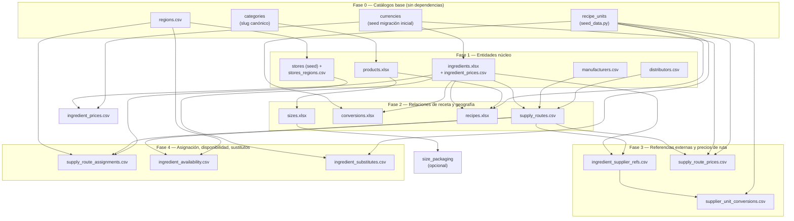

# Guía de Ingesta de Datos Reales — Qargo Coffee CPQ

> Documento de Staff Data Engineering. Auditoría de plantillas, DAG de
> dependencias, plantillas faltantes con diccionario de datos y estrategia de
> pre-flight / dead-letter. Alineado al **esquema REAL implementado**
> (`backend/models/*`, migraciones `0001`–`0024`), no al DDL de `CLAUDE.md`
> (que diverge: `BigInteger Identity`, `products.category` es FK a
> `categories.slug`, conversión en `ingredient_recipe_unit_conversions`).

---

## 0. TL;DR — el bloqueante #1

El motor de costos (`cost_calculator.py:414`) hace:

```python
base = current_price if current_price is not None else purchase_price
price_fallback[id] = Decimal(base) if base is not None else _ZERO   # ← 0 silencioso
```

`data/raw/ingredients.xlsx` trae los **429** `purchase_price = NULL`. Resultado:
el cálculo **no falla**, pero cada ingrediente cuesta **0** → el costo del producto
sale ≈ solo labor. **Falla silenciosa, no ruidosa.** Antes de cargar nada, hay
que poblar precios (catálogo y/o ruta). Ver §3 plantilla `ingredient_prices.csv`.

---

## 1. Auditoría de plantillas existentes (`data/raw/*.xlsx`)

| Archivo | Filas | Veredicto | Hallazgos críticos |
|---|---|---|---|
| `ingredients.xlsx` | 429 | ⚠️ Inservible para costos | `purchase_price` 100% NULL → costo 0 silencioso. Sin `currency`. `yield_%` mezcla convención (ver H2). Sin código/SKU canónico. |
| `products.xlsx` | 75 | ⚠️ FK frágil | `category` debe existir en `categories.slug` (FK). Valores como `"Hot Classics"` NO son slugs → la FK queda NULL (ON DELETE SET NULL no aplica en insert, pero el valor no matchea y queda huérfano). |
| `sizes.xlsx` | 169 | ✅ Aceptable | Resuelve por `product_name`. Riesgo: nombres duplicados/mayúsculas. Falta validar “un solo `is_default` por producto”. |
| `recipes.xlsx` | 323 | ⚠️ Parsing frágil | `quantity` = string con unidad embebida (`"2 Standard Shot"`). `parse_quantity_with_unit` toma la ÚLTIMA palabra como unidad → `"Standard Shot"` ⇒ unidad `shot` solo si el último token matchea un `recipe_units.name`. `"Syrup (Optional)"` como ingrediente no existe → fila descartada. |
| `conversions.xlsx` | 14 | ⚠️ Insuficiente | Solo 14 conversiones para 429 ingredientes. Toda receta con `recipe_unit` sin conversión y sin precio cae en 0. Cobertura mínima. |

### Hallazgos transversales

- **H1 — Precio sin moneda (viola P3).** Ni `ingredients.xlsx` ni el modelo
  `ingredients.purchase_price` llevan `currency_code`. Se asume COP implícito.
  `supply_route_prices` **sí** exige `currency_code` (FK `currencies.code`) y
  `price_unit_id`. Las plantillas nuevas lo incluyen siempre.
- **H2 — Convención de `yield` inconsistente.** `ingredients.xlsx` trae `0.98`
  (fracción) pero el loader valida `0 < y <= 100` y, si está vacío, asigna
  **100**. El motor trata `yield_percentage` como… depende: el comentario de
  `schemas/ingredient.py` dice 0.0–1.0. Mezclar 0.98 y 100 en la misma columna
  es corrupción latente. **Decisión recomendada: fracción 0–1 en todas las
  plantillas**, y corregir el default del loader (otro PR).
- **H3 — Resolución por nombre, no por ID.** Todo el ETL resuelve `lower(name)`.
  Frágil ante: duplicados, acentos, espacios dobles, mayúsculas. El pre-flight
  (§4) normaliza y detecta colisiones ANTES de cargar.
- **H4 — Capa supply-chain SIN plantillas ni loader.** `regions`,
  `manufacturers`, `distributors`, `supply_routes`,
  `supply_route_assignments`, `ingredient_supplier_refs`,
  `supplier_unit_conversions`, `supply_route_prices`,
  `ingredient_availability`, `ingredient_substitutes` no tienen ningún
  archivo en `/data`. Las tiendas se siembran con `region_id = NULL`. Sin esto
  no hay routing ni precio de ruta. §3 las crea.
- **H5 — `stores` sin región.** `seed_data.py` crea 17 tiendas sin `region_id`.
  `fn_resolve_supply_route` cae siempre a NULL regional → solo overrides de
  tienda funcionarían. `stores_regions.csv` (§3) cierra el gap.

---

## 2. DAG de dependencias y orden de carga

Orden estricto para no violar FKs. Cada nivel depende de que el anterior esté
commiteado.



### Secuencia ejecutable

```
Fase 0  currencies(✓seed) · recipe_units(✓seed) · categories · regions.csv
Fase 1  ingredients.xlsx · ingredient_prices.csv · products.xlsx ·
        manufacturers.csv · distributors.csv · stores_regions.csv
Fase 2  sizes.xlsx · conversions.xlsx · recipes.xlsx · supply_routes.csv
Fase 3  ingredient_supplier_refs.csv · supplier_unit_conversions.csv ·
        supply_route_prices.csv
Fase 4  supply_route_assignments.csv · ingredient_availability.csv ·
        ingredient_substitutes.csv
```

**Regla de oro:** `supply_route_prices` Y/O `ingredient_prices` deben cargarse
antes de pedir cualquier cálculo, o el motor devuelve 0 (TL;DR §0).

---

## 3. Plantillas nuevas / corregidas

Archivos en `data/templates/`. Todas resuelven por **nombre natural**
(consistente con el ETL actual). La **clave natural de una ruta** es la tripleta
`(ingredient_name, manufacturer_name, distributor_name)` — `distributor_name`
vacío = compra directa al fabricante.

Convenciones comunes: encoding UTF-8, separador coma, fechas `YYYY-MM-DD`,
booleanos `true`/`false`, decimales con punto, vacío = NULL.

### 3.1 `ingredient_prices.csv` — **CORRIGE EL BLOQUEANTE #0**

Puebla `ingredients.purchase_price` (+ historial → trigger setea `current_price`).
Precio de catálogo, ruta-agnóstico, usado cuando se calcula sin tienda.

| Columna | Tipo SQL | Req | Regla de validación |
|---|---|---|---|
| `ingredient_name` | `varchar(180)` | Sí | Debe existir en `ingredients.name` (case-insensitive). |
| `purchase_price` | `numeric(14,4)` | Sí | `> 0`. Sin separador de miles. |
| `currency_code` | `char(3)` | Sí | Debe existir en `currencies.code` (`COP`/`USD`/`EUR`). |
| `source` | `varchar(120)` | No | `'manual'`/`'bulk_upload'`/`'cotizacion'`. Default `bulk_upload`. |
| `effective_date` | `date` | No | Default hoy. ≤ hoy. |

### 3.2 `regions.csv`

| Columna | Tipo SQL | Req | Regla |
|---|---|---|---|
| `name` | `varchar(120)` | Sí | No vacío. |
| `code` | `varchar(40)` | Sí | **UNIQUE**. Mayúsculas, sin espacios (`BOG`, `MED`). |
| `country_code` | `char(2)` | No | ISO-3166-1 alfa-2. Default `CO`. |
| `is_active` | `boolean` | No | Default `true`. |

### 3.3 `stores_regions.csv` — vincula tiendas existentes a región (cierra H5)

| Columna | Tipo SQL | Req | Regla |
|---|---|---|---|
| `store_code` | `varchar(40)` | Sí | Debe existir en `stores.code`. |
| `region_code` | `varchar(40)` | Sí | Debe existir en `regions.code`. |

### 3.4 `manufacturers.csv`

| Columna | Tipo SQL | Req | Regla |
|---|---|---|---|
| `name` | `varchar(160)` | Sí | No vacío. Único recomendado (no forzado en DB). |
| `country_code` | `char(2)` | No | Default `CO`. |
| `tax_id` | `varchar(40)` | No | NIT. |
| `website` | `text` | No | URL válida si presente. |
| `is_active` | `boolean` | No | Default `true`. |

### 3.5 `distributors.csv`

| Columna | Tipo SQL | Req | Regla |
|---|---|---|---|
| `name` | `varchar(160)` | Sí | No vacío. |
| `country_code` | `char(2)` | No | Default `CO`. |
| `tax_id` | `varchar(40)` | No | NIT. |
| `contact_email` | `varchar(160)` | No | Formato email si presente. |
| `contact_phone` | `varchar(40)` | No | — |
| `is_active` | `boolean` | No | Default `true`. |

### 3.6 `supply_routes.csv`

Define qué rutas existen. `is_direct=true` ⇒ `distributor_name` DEBE ir vacío
(CHECK `ck_supply_routes_direct_no_distributor`). Sin `is_direct`, al menos
fabricante O distribuidor.

| Columna | Tipo SQL | Req | Regla |
|---|---|---|---|
| `ingredient_name` | `varchar(180)` | Sí | Existe en `ingredients`. |
| `manufacturer_name` | `varchar(160)` | Cond | Existe en `manufacturers`. Vacío permitido si hay distribuidor. |
| `distributor_name` | `varchar(160)` | Cond | Existe en `distributors`. **Vacío obligatorio si `is_direct=true`**. |
| `is_direct` | `boolean` | No | Default `false`. Si `true` ⇒ distribuidor vacío. |
| `is_active` | `boolean` | No | Default `true`. |

### 3.7 `ingredient_supplier_refs.csv`

Nombre/código externo del ingrediente por ruta. UNIQUE `(ingredient, route)`.

| Columna | Tipo SQL | Req | Regla |
|---|---|---|---|
| `ingredient_name` | `varchar(180)` | Sí | Existe en `ingredients`. |
| `manufacturer_name` | `varchar(160)` | Cond | Parte de la clave de ruta. |
| `distributor_name` | `varchar(160)` | Cond | Parte de la clave de ruta. |
| `external_name` | `varchar(180)` | Sí | Nombre tal cual en factura del proveedor. |
| `external_code` | `varchar(80)` | No | SKU/EAN. UNIQUE por ruta si presente. |
| `purchase_unit` | `varchar(40)` | Sí | Unidad de compra (`bolsa 5kg`, `caja 12un`). |
| `units_per_pack` | `numeric(14,6)` | No | `> 0`. Unidades base por empaque. |

### 3.8 `supplier_unit_conversions.csv`

Convierte unidad de compra del proveedor → unidad de receta. UNIQUE
`(ingredient_ref, recipe_unit)`.

| Columna | Tipo SQL | Req | Regla |
|---|---|---|---|
| `ingredient_name` | `varchar(180)` | Sí | Identifica el ref vía ruta. |
| `manufacturer_name` | `varchar(160)` | Cond | Clave de ruta. |
| `distributor_name` | `varchar(160)` | Cond | Clave de ruta. |
| `recipe_unit` | `varchar(60)` | Sí | Existe en `recipe_units.name`. |
| `purchase_qty` | `numeric(14,6)` | Sí | `> 0`. Unidades de compra. |
| `recipe_qty` | `numeric(14,6)` | Sí | `> 0`. Unidades de receta equivalentes. |

### 3.9 `supply_route_prices.csv`

Precio por ruta, con vigencia y moneda. CHECK `qargo_price <= list_price`.
EXCLUDE prohíbe ventanas solapadas por ruta — cargar vía `fn_ingest_route_price`
(cierra+inserta atómico). **No** hacer UPDATE.

| Columna | Tipo SQL | Req | Regla |
|---|---|---|---|
| `ingredient_name` | `varchar(180)` | Sí | Clave de ruta. |
| `manufacturer_name` | `varchar(160)` | Cond | Clave de ruta. |
| `distributor_name` | `varchar(160)` | Cond | Clave de ruta. |
| `list_price` | `numeric(14,4)` | Sí | `> 0`. |
| `qargo_price` | `numeric(14,4)` | Sí | `> 0` **y `<= list_price`**. |
| `currency_code` | `char(3)` | Sí | Existe en `currencies.code`. |
| `price_unit` | `varchar(60)` | Sí | `recipe_units.name` → `price_unit_id`. |
| `valid_from` | `date` | No | Default hoy. |
| `source` | `varchar(120)` | No | `'contrato_2026'`, etc. |
| `created_by` | `varchar(120)` | Sí | Usuario/proceso. |

### 3.10 `supply_route_assignments.csv`

Asigna ruta a región o tienda con prioridad y vigencia. EXCLUDE: una sola por
`(scope, priority)` vigente. `scope_type` define si es regional o override.

| Columna | Tipo SQL | Req | Regla |
|---|---|---|---|
| `scope_type` | `enum` | Sí | `region` \| `store`. |
| `scope_code` | `varchar(40)` | Sí | `regions.code` o `stores.code` según `scope_type`. |
| `ingredient_name` | `varchar(180)` | Sí | Clave de ruta. |
| `manufacturer_name` | `varchar(160)` | Cond | Clave de ruta. |
| `distributor_name` | `varchar(160)` | Cond | Clave de ruta. |
| `priority` | `integer` | No | `>= 1`. Default `1` (primaria). 2 = alternativa. |
| `valid_from` | `date` | No | Default hoy. |
| `assigned_by` | `varchar(120)` | Sí | No vacío. |
| `change_reason` | `varchar(160)` | No | `precio`/`desabastecimiento`/`calidad`/… |

### 3.11 `ingredient_availability.csv` (opcional, observacional)

| Columna | Tipo SQL | Req | Regla |
|---|---|---|---|
| `ingredient_name` | `varchar(180)` | Sí | Existe en `ingredients`. |
| `scope_type` | `enum` | Sí | `route` \| `region`. |
| `manufacturer_name` | `varchar(160)` | Cond | Si `scope_type=route`. |
| `distributor_name` | `varchar(160)` | Cond | Si `scope_type=route`. |
| `region_code` | `varchar(40)` | Cond | Si `scope_type=region`. |
| `status` | `enum` | Sí | `available`\|`shortage`\|`discontinued`\|`seasonal`. |
| `expected_resume` | `date` | Cond | Solo si `status=shortage` (CHECK). |
| `valid_from` | `date` | No | Default hoy. |

### 3.12 `ingredient_substitutes.csv` (opcional, corporativo)

| Columna | Tipo SQL | Req | Regla |
|---|---|---|---|
| `original_ingredient_name` | `varchar(180)` | Sí | Existe en `ingredients`. |
| `substitute_ingredient_name` | `varchar(180)` | Sí | Existe **y ≠ original** (CHECK no-self). |
| `approved_by` | `varchar(120)` | Sí | No vacío. |
| `approval_date` | `date` | Sí | ≤ hoy. |
| `activation_condition` | `enum` | No | `shortage`\|`unavailable`\|`always`. Default `shortage`. |
| `quantity_ratio` | `numeric(14,6)` | No | `> 0`. Default `1.0`. |
| `recipe_unit` | `varchar(60)` | No | `recipe_units.name`. |
| `cost_impact_pct` | `numeric(6,3)` | No | Puede ser negativo. |
| `valid_from` | `date` | No | Default hoy. |

---

## 4. Estrategia de errores e ingesta sucia (pre-flight + dead-letter)

### Filosofía

Dos clases de error, dos reacciones:

1. **Error de FILA (dato sucio resoluble):** unidad inexistente, ingrediente no
   encontrado, `qargo_price > list_price`, fecha inválida. → **NO frena el
   batch.** La fila va a **dead-letter** (`data/_rejects/<archivo>.rejects.csv`)
   con columna `reject_reason`, y la carga continúa con las filas válidas.
   Esto evita que 1 fila mala bloquee 5.000 buenas.

2. **Error ESTRUCTURAL (rompe el batch entero):** falta una columna requerida,
   archivo ilegible, catálogo base ausente (p. ej. `currencies` vacío), o
   violación de invariante que corrompería el set (clave natural duplicada que
   haría ambiguo el routing). → **`--strict` aborta** antes de tocar la DB.

### Pre-flight check (antes de cualquier INSERT)

`backend/migrations/preflight_check.py` (incluido). Valida **contra la DB en
seco** sin escribir:

```
python -m backend.migrations.preflight_check data/templates/supply_route_prices.csv \
       --type route_prices            # valida 1 archivo
python -m backend.migrations.preflight_check data/templates/ --all   # todo el dir
python -m backend.migrations.preflight_check data/templates/ --all --strict
```

Por cada archivo:
1. **Esquema:** columnas requeridas presentes (si falta → abort/strict).
2. **Normalización:** trim, colapso de espacios, `lower()` para lookups;
   detecta colisiones de nombre (H3).
3. **FK en seco:** resuelve cada `*_name`/`*_code` contra la DB; no resoluble →
   dead-letter.
4. **Reglas de negocio:** `qargo<=list`, `>0`, `valid_until>=valid_from`,
   `currency in currencies`, `recipe_unit in recipe_units`, no-self-substitute,
   `expected_resume` solo en shortage, `is_direct ⇒ sin distribuidor`.
5. **Salida:** `OK n filas | REJECT m filas → _rejects/...` + exit code
   (`0` todo limpio, `2` hubo rechazos, `1` error estructural).

### Reacción al caso del enunciado

> un proveedor manda una unidad de medida que no existe en el catálogo

→ La fila se manda a **dead-letter** con
`reject_reason="recipe_unit 'X' no existe en recipe_units"`. El batch sigue.
El operador revisa `_rejects/`, decide si (a) agregar la unidad a `recipe_units`
y reprocesar solo el rejects, o (b) corregir el dato origen. **Nunca** se
inventa la unidad ni se inserta con FK NULL silenciosa.

### Flujo de reproceso

```
cargar → revisar _rejects/*.rejects.csv → corregir catálogo o dato →
re-correr SOLO el archivo de rejects (es un CSV válido con la misma cabecera) →
hasta que rejects = 0
```

---

## 5. Checklist go-live de datos

- [ ] `currencies`, `recipe_units`, `categories` sembrados.
- [ ] `regions.csv` cargado; `stores_regions.csv` vincula las 17 tiendas.
- [ ] `ingredients.xlsx` + **`ingredient_prices.csv`** (sin esto, costo = 0).
- [ ] `products.xlsx` con `category` = slug existente en `categories`.
- [ ] `conversions.xlsx` cubre TODO `recipe_unit` usado en `recipes.xlsx`.
- [ ] Supply-chain (rutas/refs/conversiones/precios) si se usa routing por tienda.
- [ ] `preflight_check.py --all` → 0 rejects estructurales.
- [ ] Cálculo de prueba en 1 producto real con costo > 0 y desglose coherente.
